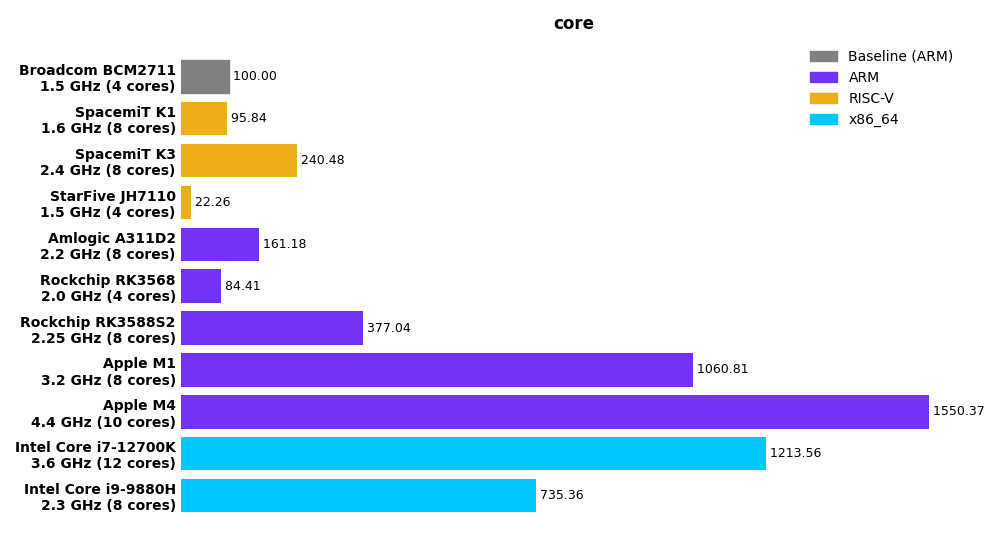
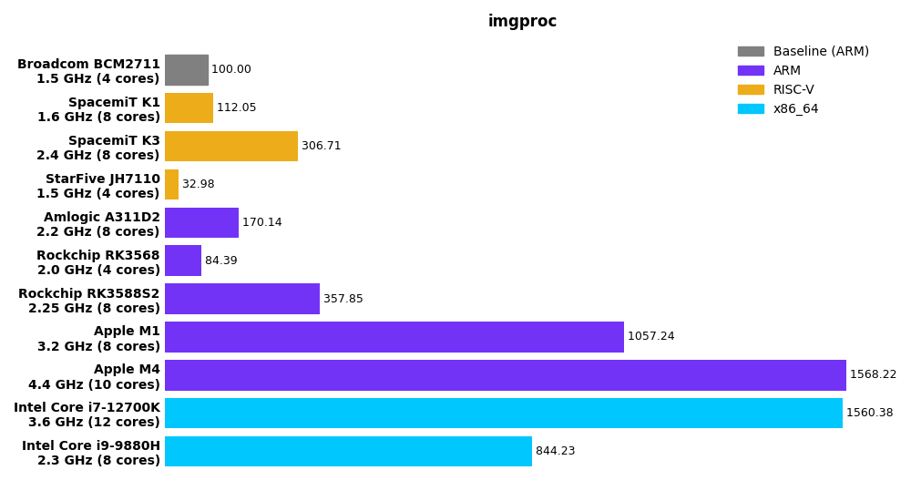
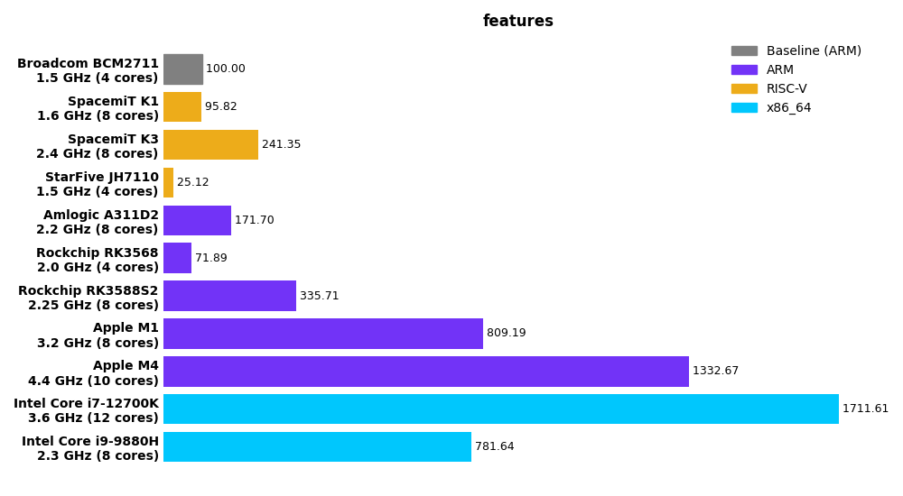
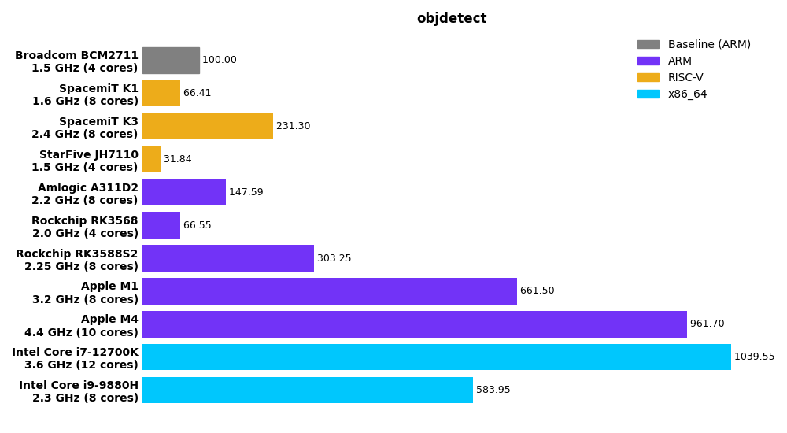
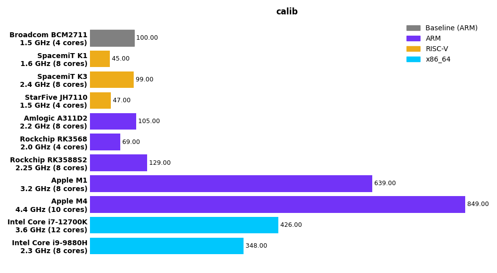
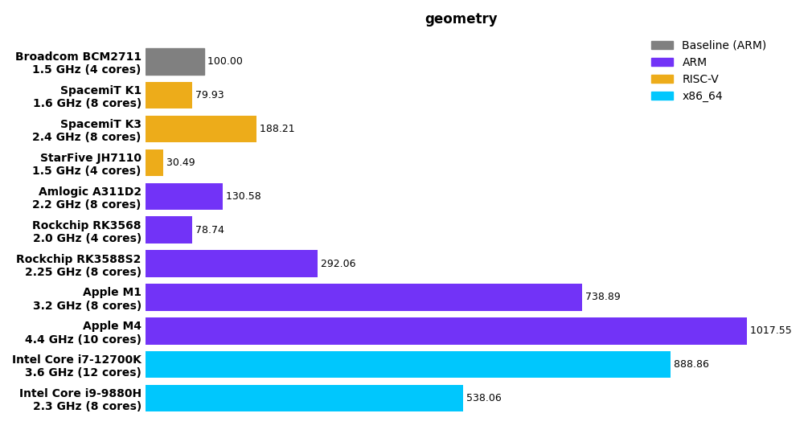
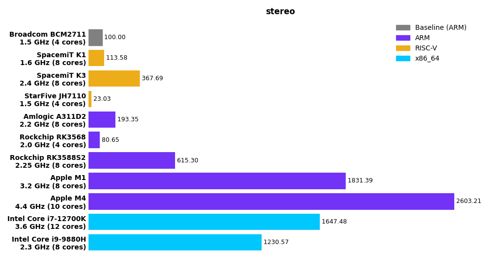
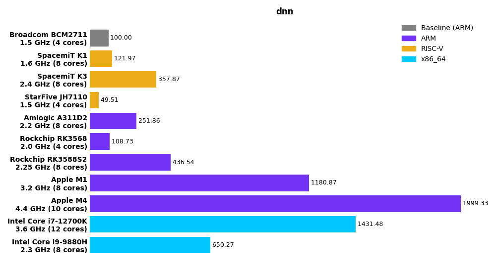

# CVBenchmark

The repository is to evaluate various CPUs' performance with OpenCV's Performance Tests. The scores are calibrated against a baseline score of 100 (which is the score of a **Broadcom BCM2711** by default). Higher scores indicate better CPU performance.

\
*Scores are computed on OpenCV 5.0.0*

## How to compute the score

OpenCV's Performance Tests evaluate the speed of OpenCV functions run under controlled conditions. Each OpenCV module includes several test suites, and each test suite contains multiple test cases. For each test case, a performance score is computed as:

$$ score = \frac{\text{Baseline CPU Time}}{\text{CPU Time}} \times 100 $$

where:
- Baseline CPU Time is the arithmetic mean runtime (in milliseconds) of the test case measured on the baseline CPU.
- CPU Time is the corresponding runtime measured on the tested CPU. 

The geometric mean of all test case scores within a test suite represents the score on that test suite. Similarly, the geometric mean of all test suite scores forms the score on the module.
**The overall benchmark score** is obtained as the geometric mean of all module scores.

After the benchmark completes, the overall score (labeled 'Score' in the table) and scores on each tested module are shown in the following table:


| module    |   Amlogic A311D2 |   Apple M1 |   Apple M4 |   Intel Core i7-12700K |   Intel Core i9-9880H |   Rockchip RK3568 |   Rockchip RK3588S2 |   SpacemiT K1 |   SpacemiT K3 |   StarFive JH7110 |
|:----------|-----------------:|-----------:|-----------:|-----------------------:|----------------------:|------------------:|--------------------:|--------------:|--------------:|------------------:|
| calib     |           105    |     639    |     849    |                 426    |                348    |             69    |              129    |         45    |         99    |             47    |
| stereo    |           193.35 |    1831.39 |    2603.21 |                1647.48 |               1230.57 |             80.65 |              615.3  |        113.58 |        367.69 |             23.03 |
| geometry  |           130.58 |     738.89 |    1017.55 |                 888.86 |                538.06 |             78.74 |              292.06 |         79.93 |        188.21 |             30.49 |
| core      |           161.18 |    1060.81 |    1550.37 |                1213.56 |                735.36 |             84.41 |              377.04 |         95.84 |        240.48 |             22.26 |
| features  |           171.7  |     809.19 |    1332.67 |                1711.61 |                781.64 |             71.89 |              335.71 |         95.82 |        241.35 |             25.12 |
| imgproc   |           170.14 |    1057.24 |    1568.22 |                1560.38 |                844.23 |             84.39 |              357.85 |        112.05 |        306.71 |             32.98 |
| objdetect |           147.59 |     661.5  |     961.7  |                1039.55 |                583.95 |             66.55 |              303.25 |         66.41 |        231.3  |             31.84 |
| dnn       |           251.86 |    1180.87 |    1999.33 |                1431.48 |                650.27 |            108.73 |              436.54 |        121.97 |        357.87 |             49.51 |
| **Score** |       **161.55** | **940.66** |**1390.94** |            **1147.62** |            **673.75** |         **79.67** |          **329.52** |     **87.4**  |    **237.42** |         **31.46** |

*The baseline CPU is Broadcom BCM2711.*

Visualized score charts on each module are shown below, and the overall score of each device across all tested modules is shown in the figure above.

|       |        |
|-------|--------|
|  |  |
|       |        |
|  |  |
|       |        |
|  |  |
|       |        |
|  |  |

*Scores are computed on OpenCV 5.0.0. For scores on OpenCV 4.13.0, refer to perf/4.13.0/score*

CPU specs:
- **Broadcom BCM2711**: quad-core ARM Cortex-A72 (ARMv8, 1.5 GHz). Corresponding SBC used is Raspberry Pi 4 Model B.
- **Amlogic A311D2**: quad-core ARM Cortex-A73 (2.2 GHz) and quad-core ARM Cortex-A53 (2.0 GHz). Corresponding SBC used is Khadas VIM4.
- **Apple M1**: 4 performance cores (3.2 GHz) and 4 efficiency cores.
- **Apple M4**: 4 performance cores (4.4 GHz) and 6 efficiency cores.
- **Intel Core i7-12700K**: 8 Performance cores (3.60 GHz, turbo boost up to 4.90 GHz), 4 Efficient cores (2.70 GHz, turbo boost up to 3.80 GHz).
- **Intel Core i9-9880H**: 8 cores (2.3 GHz, turbo boost up to 4.8 GHz).
- **Rockchip RK3568**: quad-core ARM Cortex-A55 (up to 2.0 GHz). Corresponding SBC used is Firefly ROC-RK3568-PC.
- **Rockchip RK3588S2**: quad-core ARM Cortex-A76 (2.25 GHz) and quad-core ARM Cortex-A55 (1.8 GHz). Corresponding SBC used is Khadas Edge2 ARM PC.
- **SpacemiT K1**: octa-core 64-bit RISC-V AI CPU (1.6 GHz). Corresponding SBC used is MUSE Pi V30.
- **SpacemiT K3**: octa-core 64-bit RISC-V AI CPU (2.4 GHz). Corresponding SBC used is K3 Pico-ITX.
- **StarFive JH7110**: quad-core 64-bit RISC-V CPU (1.5 GHz). Corresponding SBC used is StarFive VisionFive 2.

## How to run the benchmark

Clone the repository on every machine you want to benchmark:
```shell
git clone https://github.com/opencv/cvbenchmark.git && cd cvbenchmark
```

- The `benchmark.py` script has three subcommands:
  - `perf`: check out OpenCV, build it, and run OpenCV performance tests.
  - `score`: compare XML files of performance tests and compute scores.
  - `bench`: run `perf` and then immediately run `score` on the same machine.

### Run and Score

Run `benchmark.py bench` to get the CPU score of your device against Broadcom BCM2711 by default.

```bash
python benchmark.py bench --arch riscvv --cpu-model 'SpacemiT K3' --figure
```

If you want to compute the score against another baseline CPU or with another version of OpenCV (default version is 4.13.0), run for example:
```bash
python benchmark.py bench --arch riscvv --cpu-model 'SpacemiT K3' --version 5.0.0 --baseline 'Rockchip RK3588' --figure
```

Run `python benchmark.py bench --help` for for usage information.

### Run performance tests

`benchmark.py perf` builds OpenCV, runs OpenCV performance tests and writes XML result files for that device, without computing the CPU score against a baseline CPU.

```bash
python benchmark.py perf --arch riscvv --cpu-model 'SpacemiT K3'
```

If you want to run performance tests of a specific OpenCV version or selected OpenCV modules, run for example:
```bash
python benchmark.py perf --arch riscvv --cpu-model 'SpacemiT K3' --version 5.0.0 --modules core imgproc
```
It creates `perf/5.0.0/core-SpacemiT K3.xml` and `perf/5.0.0/imgproc-SpacemiT K3.xml`.

Run `python benchmark.py perf --help` for for usage information.


### Compute scores

`benchmark.py score` compares the XML files against those of the baseline CPU and computes the CPU score(s).

```bash
python benchmark.py score
```

By default, this scores OpenCV `4.13.0` results against the baseline CPU `Broadcom BCM2711`.

Use:
- `--version` to score another OpenCV version.
- `--baseline` to choose a different baseline CPU. The baseline string must match the `--cpu-model` value used when creating the baseline XML files.
- `--modules` to score only selected modules.
- `--figure` to output score charts.

For example:
```bash
python benchmark.py score --version 5.0.0 --baseline 'Rockchip RK3588' --modules core imgproc --figure
```
> Note:
> - Before using `--figure`, fill in `processor.json`. Each processor entry's `Processor` value must match the CPU model names used with `benchmark.py perf --cpu-model`.
> - If you run `benchmark.py perf` on several different target CPUs, collect all generated XML files into the same corresponding directory on one scoring machine before computing the scores.

Run `python benchmark.py score --help` for for usage information.

## License

This project is licensed under [Apache 2.0 License](./LICENSE).
